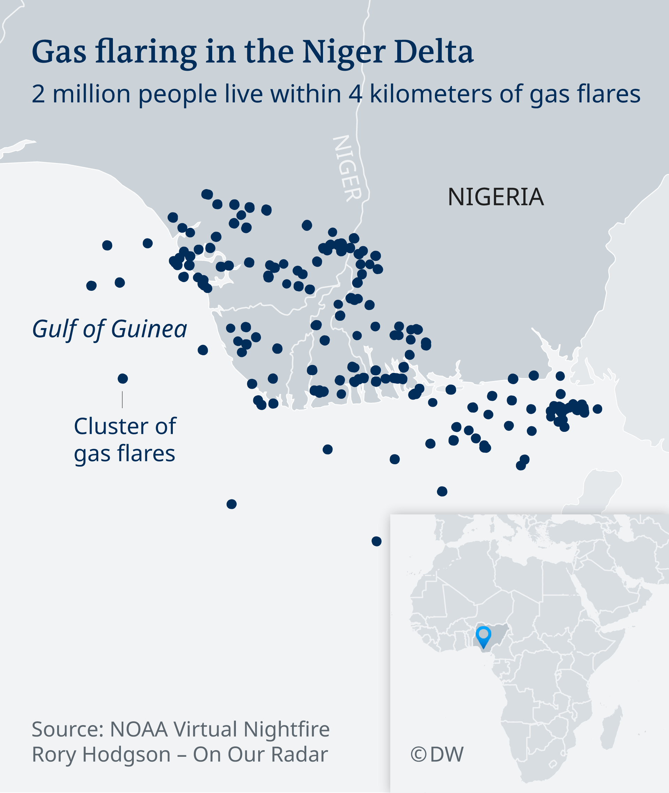
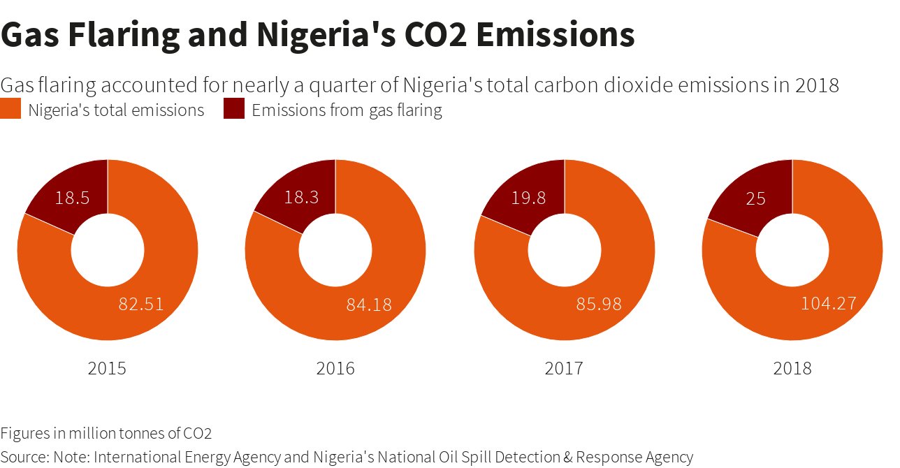
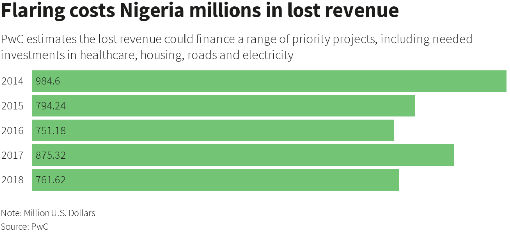
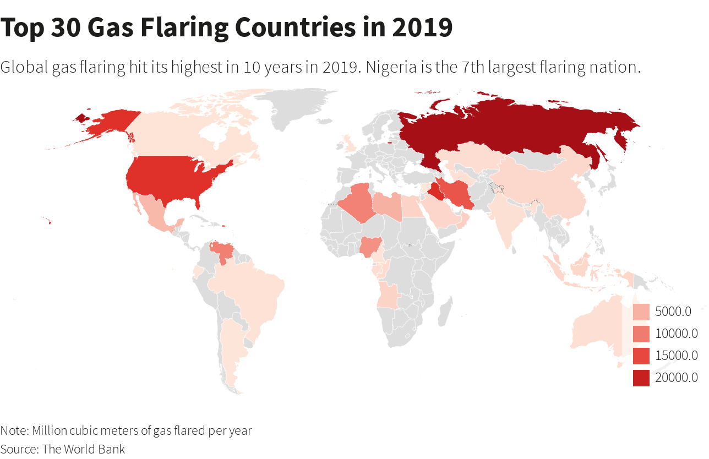
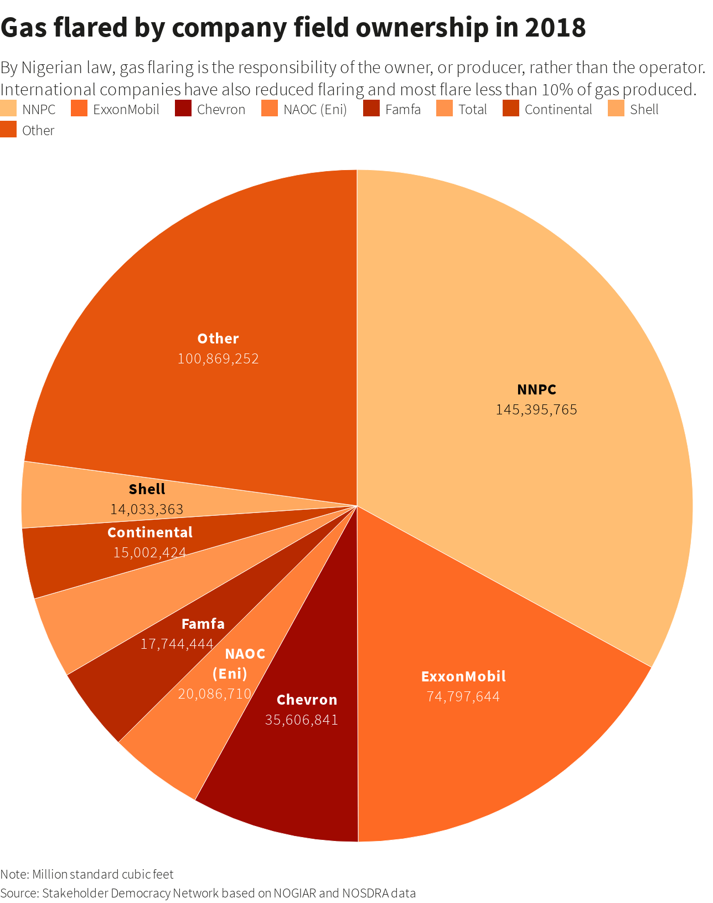
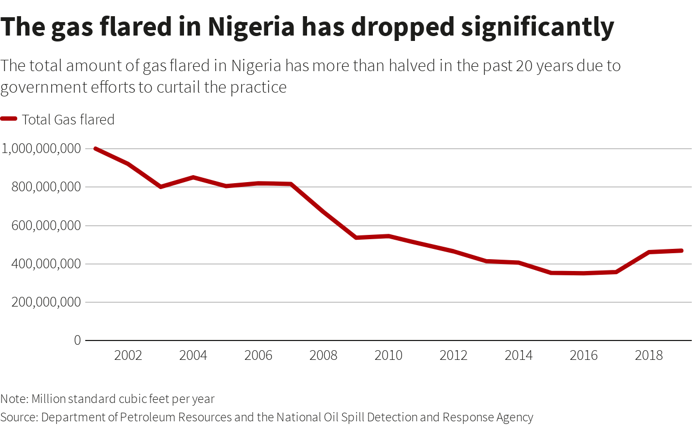
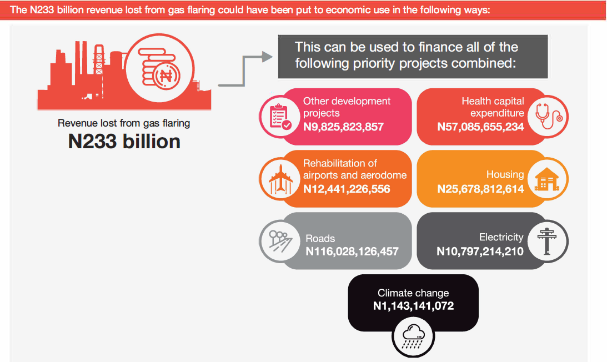

# Hackathon - AI for Energy

# 1.0   Problem Statement/Definition

**Investors** need **to be convinced to invest in refined natural gas and associated gases** because **it will markedly reduce or even eliminate gas flaring incidences which will ultimately lead to reduced greenhouse gas emissions(which is highly detrimental to the surrounding environment, lives and properties) and consequently, carbon reduction in accordance with the Paris agreement, when provided with sufficient data and powerful insights with the aid of AI.**

## 1.1  Prevalence of the problem

According to satellite data from **Nigeria’s environment ministry**, oil companies in the country flare over **313.0mscf of gas annually** which ultimately results in **16.5m tonnes of CO2 emitted into the atmosphere**. In a similar fashion, **World Bank’s Global Gas Flaring Reduction Partnership (GGFRP)** ranks Nigeria as the **6th largest gas flaring country globally**. Gas flaring has been a severe menace, partiarly in the Niger Delta, causing several economic and health losses for its citizens. In the oil-rich Niger Delta of southern Nigeria, about 2 million people live within 4 kilometers (2.5 miles) of a gas flare (Schick et al, 2018), which makes them more vulnerable to several health issues as well as deformities in children especially. From the year 1996-2010, in Nigeria, 12,602,480.25 million ft3 of natural gas was flared (NNPC). This is equivalent to losing about 12,967.952 × 1012 Btu of energy that would have been used for something profitable.

## 1.2  Cause of the problem

Gas flaring is the burning of natural gas that is associated with crude oil when it is pumped up from the ground. In petroleum-producing areas where insufficient investment was made in infrastructure to utilize natural gas, flaring is employed to dispose of this associated gas. Gas flaring is commonplace during production or industrial activities on oil rigs, refineries, chemical and coal plants. In the process of flaring, excess amounts of carbon dioxide and methane are released into the atmosphere, resulting in depletion of the ozone layer, acid rain and global warming.  Some oil and gas companies prefer to flare gas as it prevents over-pressuring of industrial plant equipment. Here are some of the common causes that lead to the seemingly inevitable gas flaring: 

- Inability to sufficiently predict the yields before refinery process creates challenges such as inadequacy in planning the operating conditions to meet product target, product optimisation failure, reluctancy of potential investors to invest and inability to meet product market specification
- Oil fields are mostly remote i.e. too distant from the nearest utilizers and gas transport infrastructures are insufficient.
- Oil fields have significant amount of associated gas in locations where re­injection is not possible.
- Low, subsidized gas prices reduce the incentive to bring associated gas to market as the gas market and infrastructure are underdeveloped due largely to dysfunctional pricing and other institutional issues in both electricity and natural gas markets., there are limited financial incentives to exploit associated gas, and consumers are not willing to pay appropriate price for it so they would rather flare it.
- Oil sales supply a majority of government revenue, and a high share of Nigeria’s oil fields have associated gas and because the government needs that revenue, flaring will continue until there is a viable outlet for the associated gas.
- In some instance, the cost of processing the associated gas and transporting it to the market for sale, is higher than the market sale price itself.

Due to these operational and cost inefficiency, most associated gas is flared.

## 1.3  Who (whom) has identified the proble

The problem has been identified by:

- **The Nigerian government**: The government has acknoledged the menace constituted by gas flaring as far as 1979 when the Associated gas re-injection act was established. Through the NGFCP and NGP the government has made continual efforts to put an end to gas flaring. Several methods have been employed along the line. These include:
    1. Driving investment into the gas sector
    2. Introduction of fines for failure to provide accurate flare data, sign connection agreement and allow access to flare sites.

    In relation to different measures put in place the government hoped to end gas flaring by 2020. Clearly this target was not met but there are hopes that inline with the **Paris accord**, the government achieves its aim by 2030.

- **Indigenous and international oil producing companies**: these companies have played a role by investing in gas commercialisation projects on the NGFCP. They also seek innovative solutions that would help reduce gas flaring levels significantly.
- **The World bank**- According to the 2021 [Global Gas Flaring tracker report](https://thedocs.worldbank.org/en/doc/1f7221545bf1b7c89b850dd85cb409b0-0400072021/original/WB-GGFR-Report-Design-05a.pdf) published by the world bank,

    > "Russia, Iraq, Iran, the United States, Algeria, Venezuela
    and Nigeria remain the top seven gas flaring countries
    for nine years running, since the first of two satellites
    was launched in 2012.".

    As the world bank highlights Nigeria as one of the top gas flaring countries, the organization also promises to scale up its efforts in collaborating with the country to address challenges hindering the reduction of gas flaring.

## 1.4  Affected group/demography

Gas flaring has impoverished the communities where it is practiced, with attendant environmental, economic and health challenges especially the Niger Delta region and also communities in Akwa Ibom, Bayelsa, Cross rivers, Rivers, Edo and Ondo where oil rigs are located.
These difficulties faced by local communities from gas flares are a sufficient justification for ending gas flaring practice.

## 1.5  Adverse effect of the problem

Gas flaring introduces toxic pollutants such as sulfur dioxide, carbon dioxide and methane into the atmosphere, which can lead to environmental problems such as acid rain, as well as the generation of greenhouse gases which contribute to global climate change (Obanijesu et al. 20091, Osuji and Avwiri 20052). When the burning of natural gas occurs in close proximity to wildlife or inhabited areas, the effects raise potential environmental and health concerns. Gas flaring has been a severe menace, particularly in the Niger Delta, causing several economic and health losses for its citizens. In the oil-rich Niger Delta of southern Nigeria, about 2 million people live within 4 kilometers (2.5 miles) of a gas flare, which makes them more vulnerable to several health issues including cancer and lung damage, as well as deformities in children, asthma, bronchitis, pneumonia, neurological and reproductive problems which have become prominent among pregnant women and newborns in the region.

## 1.6  Why should the problem be solved?

The economic effect of gas flaring is quantified in terms of the lost amount of revenue that could have been generated from utilizing the volume of gas flared therefore, we should solve this problem in order to obtain revenue to finance other projects because the amount of potential revenue lost from gas flaring is comical to say the least.

Also, we the problem should be solved in order:

- To reduce greenhouse gas emission, in accordance with the paris agreement.
- To utilize the acquired natural gas in ways that could solve or reduce some of the nation's pressing challenges.

## 1.7  List the major stakeholders leading advocacy or actively championing for this problem

1. [Nigeria Gas Flare Commercialization Programme](https://ngfcp.dpr.gov.ng/) (NGFCP)
2. The World Bank
3. [Friends of the Earth International](https://www.foei.org/) (FoEI)
4. [World Bank Global Gas Flaring Reduction Partnership (GGFR)](https://www.worldbank.org/en/programs/gasflaringreduction)

## 1.8  List the major stakeholders leading advocacy or actively building solutions for the proble

1. National Oil Spill Detection and Response Agency (NOSDRA)
[oilspillalerts@nosdra.gov.ng](mailto:oilspillalerts@nosdra.gov.ng)

2. Stakeholder Democracy Network
+234 (0) 703 1593 783

3. Global Gas Flaring Reduction Partnership (GGFR)
(202) 473-1000

4. [Baker Hughes](https://www.bakerhughesds.com/)

# 2.0 **Existing Solutions**

Gas markets need an end-use application, the most obvious of which is power generation. There are several policies currently in place by the Nigerian government in a bid to regulate gas flaring and also, existing technological solutions some of which will be stated below

### 2.1 **Origin, Features and status for each solution:**

- ***Nigeria Gas Flare Commercialization Programme (NGFCP), 2017*
Origin**: A policy by the Federal Government of Nigeria (FGN). After approval by the Federal Executive Council (FEC), the programme was launched by the ministry of petroleum resources on **December 13, 2016**.
**Status:** A *Sustainable and funded solution created for the benefit of nigerians today.*
**Sharing Status:** It applies to all Nigerians especially Oil and Gas companies.
**Feature:** If implemented appropriately, a good government policy should be able to define the problem, gather evidence, identify causes, review any current policies, and strategize solutions that anticipate the social and economic response.
**Shortcomings:** Most of the aforementioned solutions are Government policies which at times, often lead to an implementation gap—that is, a widening distance between the stated policy goals and the realisation of such planned goals.
- ***Nigeria Gas Masterplan, 2008***
**Origin**: A policy by the Federal Government of Nigeria (FGN). As part of Nigeria's resolve to become a major international player in the international gas market as well as to lay a solid framework gas infrastructure expansion within the domestic market, the Nigerian Gas Master Plan was approved on **February 13 2008**.
**Status:** A *Sustainable and funded solution created for the benefit of nigerians today.*
**Sharing Status:** It applies to all Nigerians especially Oil and Gas companies.
**Feature:** If implemented appropriately, a good government policy should be able to define the problem, gather evidence, identify causes, review any current policies, and strategize solutions that anticipate the social and economic response.
**Shortcomings:** Most of the aforementioned solutions are Government policies which at times, often lead to an implementation gap—that is, a widening distance between the stated policy goals and the realisation of such planned goals.
- ***Associated Gas Reinjection Act, 1979*
Origin**: The enactment of the Associated Gas Re-injection Act in **1979** formalized its determination to end gas flaring. The Act provided a 5-year moratorium for IOCs to stop gas flaring. It also introduced penalties for non-compliance. Thus, by virtue of this law, gas flaring became illegal from January 1, 1984.
**Status:** A *Sustainable and funded solution created for the benefit of nigerians today.*
**Sharing Status:** It applies Oil and Gas to companies.
**Feature:** If implemented appropriately, a good government policy should be able to define the problem, gather evidence, identify causes, review any current policies, and strategize solutions that anticipate the social and economic response.
**Shortcomings:** Most of the aforementioned solutions are Government policies which at times, often lead to an implementation gap—that is, a widening distance between the stated policy goals and the realisation of such planned goals.
- ***FlareIQ*
Origin:** It is a flare control and digital verification product created by Panametrics, a Baker Hughes business. Panametrics’ groundbreaking [flare.IQ](http://flare.iq/) technology significantly reduces methane slip emissions, minimizes costs from flaring operations, and improves transparency for flare operations.
**Status:** The product technology is currently being advertised and routinely used by some industry to help with operational efficiencies and carbon reduction. There are numerous articles that talks about the product, user benefits and how it works. [Here](https://www.bakerhughes.com/company/energy-forward/can-we-improve-flaring-cut-down-carbon-emissions) is one of the articles.
**Sharing Status:** The product is only available commerciallly.
- ***Street Smarts*
Origin:** It was created during a hackathon by [Ethan Uner](https://devpost.com/euner) and [Devin Uner](https://devpost.com/Devin-Uner) which came First Place in the Sustainable Hackathon hosted by [devpost](https://devpost.com/hackathons)
**Status:** The solution is currently ongoing modifications from what I read on the [devpost](https://devpost.com/software/street-smarts) article. They are working on getting enough camera feeds to be able to integrate their openCV code with visualization.
**Sharing Status:** The Published but has IP rights.
**Feature: T**heir project uses **AI** and a **deep neural network with tensor flow** to reduce carbon emissions from vehicles by minimizing the amount of time cars, busses, and trucks would need to spend at a traffic light. It utilizes **AI** with already existing red light cameras to detect the number of vehicles going to or from an intersection. They obtained data via Google Maps to connect intersections to each other and determined how many vehicles were headed towards a new intersection. Then, utilizing a **deep neural network with tensor flow**, the individual intersection can decide the most efficient traffic pattern based on the predicted incoming vehicles and the detected vehicles from the red light cameras.
**Shortcomings:** Since their project uses AI and a deep neural network with tensor flow to reduce carbon emissions from vehicles by minimizing the amount of time cars, busses, and trucks would need to spend at a traffic light, a downside to this will be the unpredictable human nature and some that don't abide bt traffic rules and regulation

## 3.0 **What needs to happen to address the problem?**

### 3.1 **Key physical infrastructures that must be in place**

The ongoing practice of gas flaring, in which the natural gas associated with petroleum extraction is burned off in the atmosphere rather than being removed by alternative which could be achieved with key physical infrastructure in place such as: 

- Subterranean reinjection of natural gas into an underground reservoir, typically one already containing both natural gas and crude oil, in order to increase the pressure within the reservoir and thus induce the flow of crude oil or else sequester gas that cannot be exported.
- Storage tanks in which natural gases are confined and stored for eventual sale.

### 3.2 **Stakeholders involved in solving the problem**

1. The Nigerian Goverment
2. Investors(bidders) who are interested in purchasing gas at flare sites.

### 3.3 **Why is AI and Data is presumed to be helpful addressing this problem?**

The **great strength of AI** lies in its ability to **learn by** **experience**, **collecting massive amounts of data from its environment**, **unravel connections that humans fail to notice**, and **recommend appropriate actions or give powerful insights** on the basis of its results based on learning from historic data. Companies in the exploration-and-production segment of the industry are using AI in multiple ways to lower their carbon footprint: from performing predictive monitoring of carbon emissions from a particular oilfield; to conducting analysis of the oil-producing potential of a given field, thus reducing the number of wells that need to be drilled; to optimizing the storage of CO₂, which can be used in the production of hard-to-get-at oil. Such enhanced oil recovery results in storing the CO₂ deep underground, rather than releasing it into the atmosphere. Another way in which AI is helping producers such as Shell lower their carbon footprint is in conducting predictive maintenance of pieces of equipment or entire systems, which allows the companies to anticipate and address potential equipment failures before they occur. From my knowledge of AI and ML and the aforementioned ways in which it contributes positively to carbon reduction, AI and ML are the best choice employed to help with advancing the problem by having a deeper and better understanding of the problem, creating more awareness to the problem and its effects, helping protect people, eliminating bias, and predicting potential outcome which we believe is the most essential as we can get insightful information and be proactive.

### 3.4 **List impact of data and available data /datasets surrounding the problem and the condition for their access**

***About data impact***

Machine learning data analysis uses algorithms to continuously improve itself over time, but quality data is necessary for these models to operate efficiently. Almost any task that can be completed with a data-defined pattern or set of rules can be automated with machine learning. This is what our solution is leveraging on. The more data you provide to the ML system, the faster that model can learn and improve. Accessing the necessary data has been a major obstacle for us.

***Access to details and quality of data***

For machine learning models to understand how to perform various actions, training datasets must first be fed into the machine learning algorithm, followed by validation datasets (or testing datasets) to ensure that the model is interpreting this data accurately therefore, not just the quantity of data but the quality of data is essential for an accurate model/solution. We haven't been able to access high-quality data to enable us effectively implement our idea. 

### 3.5 **Is such an approach feasible and sustainable?**

In the case of our proposed solution there would be dependence on the use of field based IOTs that collect several categories of data to feed the model and improve prediction accuracy.

- For sustainability we are looking towards making these IOTs solar powered. In the future we hope to also look into other sustainable energy sources

## 4.0 **Possible Artificial Intelligence Solutions**

### 4.1 **Technical features of the solutions**

Our proposed solution will be able to predict the yield of natural and associated gases from refinery processes in order to persuade investors into investing and as a result, exploit associated gases which would indirectly reduce emissions from gas flaring as the activity would be greatly limited. The **great strength of AI** lies in its ability to **learn by** **experience**, **collecting massive amounts of data from its environment**, **unravel connections that humans fail to notice**, and **recommend appropriate actions or give powerful insights** on the basis of its results based on learning from historic data. By starting small, using prototypes and pilots, we can create a strong basis for further learning and development. We would use the minimum viable product (MVP) concept to design a workable AI system, and then iterate on it, integrating feedback to make it better and then scale it up. Companies looking to reduce their carbon footprint should turn the AI and Machine Learning.

### 4.1.1 **Must have**

The main fuctionality of our AI solution is the **predictive analysis** that would enable investors and capitalists alike to be convinced to invest in gases gotten from the fractional distillation process of petroleum refineries so that they can be utilized in other meaningful ways that would be economically and thus, preventing those gases from being flared like the current situation of things which would **ultimately** lead to less greenhouse gas emissions. The solution will provide investors with sufficient data and projective insight which would enhance their decision making process on whether to invest or not. We believe that this solution will indirectly lead to carbon reduction as flaring will be limited to some certain extent.

### 4.1.2 **Should have**

If possible, our solution would include some functional requirements which would greatly be beneficial to operators as they can monitor and measure combustion efficiency in real-time – meaning they can reduce the amount of carbon emissions released by flares wiith flare optimization solutions. The functional requirements include but not limited to:

- **Monitoring emissions** by helping companies identify where improvements are needed along the supply value-chain;
- **Predicting emissions** by forecasting future emissions based on historical data and current reduction efforts, and consequently,
- **Reducing emissions** by providing detailed insight into ways in which the company can improve efficiency in the production process and elsewhere in order decrease their carbon footprint which is the ultimate aim.

### 4.1.3 **Could have**

Our solution could potentially utilize AI-powered data analytics to create visualize simulations, improve decision-making, reduce operational costs which would greatly improve effiiciency.

### 4.1.4 **Would not have**

The proposed version of the solution would help study and predict flare site potential but it would not use those predictions to provide the best methods to maximise this potential. The latter versions we hope to be able to implement this.

### 4.2 **Documentation of the solution**

The solution can be well documented from start to finish with extensive and understandable highlight of each main step taken. Along with this if an analytical model is implemented, steps would be provided on how to replicate it effectively. Our solution would also be made open source and shared on github. There would also be regular updates and improvement to continue to advance and improve the solution.

## 5.0 **Impact**

### 5.1 **How is this solution different from already existing approaches?**

Existing approaches to reduce the impact of gas flaring are mostly commercially inclined. These solutions do not take the following things into consideration:

- The existence of gas flare fields where commercialisation would be cost ineffective
- Dependency of locals on the thermal energy gotten from glass flares: while locals are greatly affected by the adverse effects of gas flaring a good number of them depend on these field to obtain thermal energy that powers their small businesses. The current solutions do not provide alternatives for them.

### 5.2 **How will this solution empower problem owners and champions?**

***Benefit for those directly impacted by the problem:***

1. Our solution aims to eliminate flaring or make it much less harmful for the enviroment so for the locals who are affected by fumes released from flare sites there should be a significant improvement in health and quality of life.

***Benefit for those caring about or championing the problem:***

1. In order to eliminate gas flaring The World Bank has invested in lots of proactive methods such as setting up the [Global Gas Flaring Tracker](https://thedocs.worldbank.org/en/doc/1f7221545bf1b7c89b850dd85cb409b0-0400072021/original/WB-GGFR-Report-Design-05a.pdf). Eradication of gas flaring in Nigeria which ranks high on the global gas flaring map will show that efforts of the world bank were effective and the investments were worth it.

### 5.3 **How can this solution be sustainable?**

In order for this solution to be effective:

- Data has to be easily accessible and reliable: there should be no hindrance preventing access to real time data. Also to maintain excellent data quality IOTs and other devices used in obtaining data must be well maintained and updated as required.
- There is a need of support from the goverment through its policies which should support and not hinder continued use of the solution if and when it is sucessfully deployed on flare sites.

### 5.4 **How this solution could help share more knowledge about problem solving**

I believe this solution, when implemented optimally in accordance with our plans and goals, will shed more light on the issue of gas flaring, the associated greenhouse gases emitted and the economic, health and social impact as a result; imports of allied gas products; inadequate utilization of acquired natural gases which lead to wastage of economic potential. This solution could also be an inspiration to others as AI technology, which has the ability to harness large volumes of data from divergent sources to come up with solutions to problems, has the potential to not only increase global productivity but also lower overall emissions of carbon and other potent greenhouse gases. We value efficiency in the production process which would enhance the output/yield, provide predictive analytics which would provide valuable insight to users which drives informed decision making and ultimately help in the goal of a net zero carbon future by 2030 in accordance with the Paris agreement. 

# Sources

- [https://www.pwc.com/ng/en/assets/pdf/gas-flaring-impact1.pdf](https://www.pwc.com/ng/en/assets/pdf/gas-flaring-impact1.pdf)
- [https://thedocs.worldbank.org/en/doc/1f7221545bf1b7c89b850dd85cb409b0-0400072021/original/WB-GGFR-Report-Design-05a.pdf](https://thedocs.worldbank.org/en/doc/1f7221545bf1b7c89b850dd85cb409b0-0400072021/original/WB-GGFR-Report-Design-05a.pdf)
- [https://www.reuters.com/article/us-nigeria-oil-gasflaring-insight-idUSKBN26L195](https://www.reuters.com/article/us-nigeria-oil-gasflaring-insight-idUSKBN26L195)
- [https://www.forbes.com/sites/forbestechcouncil/2020/11/16/the-role-of-ai-in-carbon-reduction-and-increased-efficiency-for-energy/?sh=4ac05bbc5c58](https://www.forbes.com/sites/forbestechcouncil/2020/11/16/the-role-of-ai-in-carbon-reduction-and-increased-efficiency-for-energy/?sh=4ac05bbc5c58)
- [https://www.dqindia.com/artificial-intelligence-can-help-reduce-carbon-footprint/](https://www.dqindia.com/artificial-intelligence-can-help-reduce-carbon-footprint/)
- [https://www.dpr.gov.ng/wp-content/uploads/2020/01/2018-NOGIAR-1.pdf](https://www.dpr.gov.ng/wp-content/uploads/2020/01/2018-NOGIAR-1.pdf)
- [https://www.sciencedirect.com/science/article/pii/S1018363915000203](https://www.sciencedirect.com/science/article/pii/S1018363915000203)
- [https://www.bcg.com/publications/2021/ai-to-reduce-carbon-emissions](https://www.bcg.com/publications/2021/ai-to-reduce-carbon-emissions)
- [https://www.bakerhughes.com/company/energy-forward/can-we-improve-flaring-cut-down-carbon-emissions?utm_source=linkedin&utm_medium=organic&utm_campaign=flare](https://www.bakerhughes.com/company/energy-forward/can-we-improve-flaring-cut-down-carbon-emissions?utm_source=linkedin&utm_medium=organic&utm_campaign=flare)
- [https://nairametrics.com/2020/02/18/gas-flaring-a-never-ending-dark-tunnel/](https://nairametrics.com/2020/02/18/gas-flaring-a-never-ending-dark-tunnel/)
- [https://medium.com/climatewed/endgasflaringng-the-unspoken-dangers-of-gas-flaring-in-nigeria-by-mista-blak-1b0755452f10](https://medium.com/climatewed/endgasflaringng-the-unspoken-dangers-of-gas-flaring-in-nigeria-by-mista-blak-1b0755452f10)
- [https://asiatimes.com/2019/12/russias-gas-flare-up-but-less-than-before/](https://asiatimes.com/2019/12/russias-gas-flare-up-but-less-than-before/)
- [https://www.dw.com/en/gas-flaring-continues-scorching-niger-delta/a-46088235](https://www.dw.com/en/gas-flaring-continues-scorching-niger-delta/a-46088235)
- [https://corporate.exxonmobil.com/Energy-and-innovation/Low-Carbon-Solutions](https://corporate.exxonmobil.com/Energy-and-innovation/Low-Carbon-Solutions)